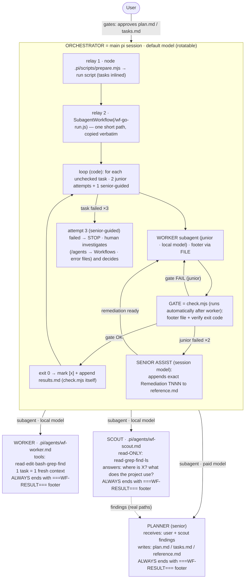

# PHILOSOPHY.md — workflow

Ultra-lightweight, pi-native agentic development system: contracts between an
orchestrator (main pi session, rotating paid model), a worker and a scout (local
models via the user's inference server). This file serves as the project
constitution and design philosophy.

**Language**: All artifacts — skills, agent prompts, specs artifacts (plan.md, tasks.md,
results.md, reference.md), and this file — are written in English.

---

## The Workflow Code (9 Inviolable Laws)

Every agent, script, and prompt in this repository is bound by these 9 inviolable laws. There are no exceptions, no heuristic shortcuts, and zero room for improvisation:

1. **Radical Lightness & Role Boundaries** — The orchestrator only orchestrates: it never reads application code or explores. The worker only implements: clean context per task, zero design decisions, returns footer and exits. The scout only locates: read-only, concrete file:line evidence. The senior (planner) only specifies: architecture, pure logic vs I/O shell, test batteries, and pre-baked algorithms in reference.md.
2. **Absolute Product Language Neutrality (Anti-Bias)** — The product may be in ANY language (C, C#, Rust, Go, Python, Swift, Zig, Java, etc.). The Node scripts are the TOOLING of the framework, NEVER the product: nothing in the contracts may assume the feature's language.
   - **PROHIBITED**: Scripts and tools MUST NOT use file extension whitelists (`.js`, `.py`, `.rs`).
   - **PROHIBITED**: Scripts and tools MUST NOT use language keyword regexes (`class`, `function`, `def`, `fn`, `func`, `struct`).
   - **PROHIBITED**: Framework contracts MUST NOT assume language-specific binaries (`node`, `npm`, `cargo`, `pip`) for application code.
3. **Human Language Neutrality (Anti-Prose-Parsing)** — Comments, notes, descriptions, and user prompts may be written in ANY natural language (English, Spanish, French, Japanese, etc.).
   - **PROHIBITED**: Deterministic scripts MUST NOT validate task complexity or atomicity by parsing natural language conjunctions, prepositions, or keywords (`and`, `then`, `managing`, `including`, `y`, `et`, `und`).
   - **RULE**: Complexity, dependencies, and atomicity are evaluated strictly by formal structural invariants and quantitative metrics (Symbol ID count, DAG dependencies, file count ≤ 2), never by grammar analysis of free text.
4. **Quantitative Atomicity via Symbol IDs (FQN)** — Cognitive load for an ultra-small local model (~2B-3B) is measured in symbols, not lines of prose.
   - Standard Symbol ID (Fully Qualified Name):
     - Application code: `<file_path>::[<Scope>.]<identifier>` (e.g. `src/net.c::getData`, `src/User.cs::UserRepository.getData`, `src/Models.cs::Data`)
     - Reference specifications: `ref::<identifier>` (e.g. `ref::createBag`)
   - **RULE**: Every task MUST define at most 2 symbols (`defines.length <= 2`). Defining 3 or more symbols is a contract breach.
   - **PROHIBITED**: Creating or expanding classes, structs, modules, traits, or namespaces with multiple methods/functions in a single task. All containers (stateful or stateless) MUST be constructed incrementally (1–2 methods per task). Every method introduced must be registered in the symbol manifest.
5. **Strict Symbol Identity & SSOT** — `tasks.md` (`notes:` and `verify:`) is the sole authority defining application symbol signatures. `reference.md` pre-bakes canonical data tables, mathematical matrices, and pure algorithm specs.
   - If a task implements an algorithm from `reference.md`, the symbol (`ref::<id>`) MUST match character-by-character.
   - **PROHIBITED**: Synonyms (`create` vs `generate`, `get` vs `calculate`). Any naming discrepancy between reference and task is an immediate contract failure.
6. **Verified Trust & Anti-Shallow Verification** — A task is complete ONLY when its `verify:` command terminates with standard exit code 0 under the OS shell. No harness signal or LLM declaration replaces exit code 0.
   - **Hierarchy**:
     1. *Behavioral*: Real execution of code asserting concrete inputs and outputs.
     2. *Compiler / Syntax Gate*: When a platform shell depends on APIs (UI, Canvas, Audio, hardware, DOM) that cannot run headless without deep mocks, the minimal mandatory verification is the project's native compiler or syntax checker (`--check`, `py_compile`, `cargo check`, `gcc -fsyntax-only`, `dotnet build`, `swiftc -typecheck`, etc.).
     3. *Prohibition*: Using plain text searching tools (`grep`, `rg`, `test -f`, reading raw files to search strings) as a substitute for compilation or execution on source code is strictly prohibited and classified as a shallow check.
7. **Immaculate Repository & Ephemeral Scratchpad** — All intermediate validation artifacts, failure logs, and symbol manifests MUST reside strictly in the temporary scratchpad: `~/.pi/pi-local-workflow/tmp/<projectKey>/`.
   - **PROHIBITED**: Creating scratch files, validation manifests, or temporary caches inside `specs/` or in the git-tracked tree.
8. **State Lives in Files, Context is Volatile** — Real system state is in `tasks.md` (active feature) and `specs/history/` (durable memory). LLM context is volatile by design: 1 task = 1 fresh context, rotating per task, never accumulating across the loop.
9. **Determinism over LLM Declaration** — Dates come from the system clock (`date +%Y-%m-%d`), sequence numbers come from the integer sequence (`T001`, `NNN`), task completion comes from process exit code (`0`), and edits are exact line edits. LLMs only interpret, plan, and unblock; scripts govern state, formatting, and numbering. On ambiguity: STOP and ask the human; never improvise.

## Architecture



Roles in one line:
- **Orchestrator** = main pi session executing the mechanical relay of `/skill:wf-go`
  (prepare.mjs + SubagentWorkflow) — the loop itself is code, not the session.
- **Worker (junior)** = local-model subagent that implements ONE atomic task
  with zero design decisions.
- **Scout** = read-only local subagent that locates things for the planner.
- **Planner (senior)** = paid-model subagent that defines the architecture,
  pre-bakes ONLY the excessively complicated (exact algorithms/data →
  reference.md), and writes the test batteries (plan/tasks/reference).

## Contracts (fixed formats, machine-validatable)

A contract is NOT prose an LLM interprets: it is a fixed format a script can
validate. If a format fails to parse, the edge-case protocol applies — never
a model's free interpretation.

**Subagent result footer** (mandatory for worker, scout and planner). Two
 carriers, same format:

- **Workflow runs (wf-go)**: the worker writes it to the RESULT FILE the task
  prompt designates (`~/.pi/pi-local-workflow/tmp/<project>/runs/<ts>/<TNNN>_a<N>_result.md`)
  as its LAST action. `check.mjs` (the gate) validates it by code: missing or
  malformed = FAILED attempt even if verify would pass. `STATUS: BLOCKED` =
  failed attempt with the reason recorded.
- **Interactive use** (scout, planner, worker invoked by hand): the LAST
  thing they emit in chat, wrapped in grep-able sentinels:

```text
===WF-RESULT===
STATUS: DONE | BLOCKED
SUMMARY: <max 200 tokens: what was done, or what blocks it>
FILES: <touched paths, comma-separated; empty if none>
===WF-END===
```

Deterministic validation (applied to EVERY subagent result):
- **No footer** (empty result, or missing sentinels) → **failed attempt**; two
  in a row → **STOP**.
- **Malformed footer** or STATUS outside `{DONE, BLOCKED}` → **failed
  attempt**, same protocol.
- The plugin's completion notification (turns, tokens, ✓) is metadata,
  **never evidence of success**.

**Task**: the format of the block below. Marking `[x]` is an exact one-line
edit, never a file rewrite.

**Reference** (`specs/changes/<feature>/reference.md`, optional): exact
data/algorithms the senior pre-bakes for the junior, plus `## Remediation TNNN`
sections appended by the senior assist. Read by LLMs only — never by scripts.

**Symbol Manifest** (`~/.pi/pi-local-workflow/tmp/<projectKey>/features/<feature>/symbols.json`, ephemeral):
machine-validatable JSON mapping tasks to defined Symbol IDs (`<file>::[<Scope>.]<identifier>`),
enforcing quantitative atomicity (≤2 symbols defined per task) and strict SSOT cross-referencing
with `reference.md` (`ref::<identifier>`). Lives only in the temporary scratchpad, validated
deterministically by `validate-tasks.mjs` before the human gate, never committed to git.

## Edge cases (fixed protocols)

Every known edge has a deterministic protocol; none leaves the decision to an
LLM's judgment:

| Case | Protocol |
|---|---|
| Subagent returns no footer (empty or no sentinels) | failed attempt; two in a row → STOP |
| Malformed footer or STATUS outside {DONE, BLOCKED} | failed attempt; two in a row → STOP |
| Subagent ends "Wrapped up" (turn limit, partial) | gate is skipped by Pi; error file may be absent. Attempt 2 and Assist inspect touched files + verify to diagnose and remediate |
| Worker reports "verify passed" in its summary | it does not count: the gate (check.mjs) checks the exit code itself |
| Task without `verify:` | accepted with weak guarantee: note "no verify" in results.md |
| Task defines >2 symbols in manifest | contract breach: validate-tasks.mjs halts with ERROR before human gate |
| Symbol in task's `implements` missing from `reference` | SSOT mismatch: validate-tasks.mjs halts with ERROR before human gate |
| `verify:` uses text-search (grep/rg) on code | shallow check: validate-tasks.mjs surfaces warning and classifies as shallow |
| `verify`/footer/BLOCKED fails twice (junior attempts) | SENIOR ASSIST: session model appends `## Remediation TNNN` to reference.md → the junior gets ONE guided retry (attempt 3) |
| Guided retry (attempt 3) also fails | STOP: the loop halts — the human investigates (error files + run card) and decides; nothing auto-continues |
| Model endpoint error (turn 0 fail in <1s, 0 tokens) | 2 null attempts with no touched files; assist returns BLOCKED → STOP — check /llama if models changed |
| Worker cannot write the result file (path/permissions) | surfaces as footer-missing → retry → STOP; if systematic, move the run dir inside the project |
| Task skipped from the workflow inspector (`s`) | counts as a failed attempt (agent() returns null) — ×2 → assist finds no error files → STOP |
| Run directory left behind after a STOP | intentional: error files are investigation evidence; delete manually after review |
| Duplicate or corrupt task ID | abort: broken contract, the human fixes it |
| Date in any document | `date +%Y-%m-%d` from the system, never the model's memory |
| Orchestrator loses track / session interrupted | real state is in `tasks.md`: re-read and continue |

## Project structure

```
workflow/
├── PHILOSOPHY.md        # constitution and framework design philosophy
├── .agents/             # tool-agnostic (pi, opencode, Claude Code...)
│   ├── skills/          # skills wf-init · wf-plan · wf-tasks · wf-go · wf-archive
│   └── workflows/       # wf-go.js — the deterministic loop (portable script)
├── .pi/
│   ├── agents/
│   │   ├── wf-worker.md     # worker agent (frontmatter: tools, max_turns 40)
│   │   ├── wf-scout.md      # scout agent (read-only, max_turns 20)
│   │   └── wf-planner.md    # planner agent (inherits session model)
│   └── scripts/             # deterministic CLI (Node stdlib, 0 deps):
│       # init · new-feature · validate-tasks · prepare · check (the gate) · archive
└── specs/               # what the system consumes — shared in the repo
    ├── config/          # models.json — worker/scout profiles → the ONLY place to touch models
    ├── history/         # finished features = durable memory (read by the planner)
    └── changes/         # ONE active feature: plan.md · tasks.md · results.md
                         # (+ reference.md when the senior pre-bakes hard parts)
```

Task format (the heart — designed so a small model cannot fail):

```markdown
- [ ] T004 Create email validator in src/validators/email.ext
      files: src/validators/email.ext
      needs: T001, T002
      verify: <project-toolchain-test-command>
      notes: follow the pattern of src/validators/phone.ext
```

## Operational rules for any agent working here

- **The worker never touches** `tasks.md`: it writes code and
  returns its summary. State is managed by the orchestrator alone.
- **Changing a model** = editing `specs/config/models.json`. Nothing else.
  No other file contains model names.
- **No verify, no [x]** (if the task has `verify:`). Without it, the guarantee
  is only the summary, noted as "no verify" in results.md. No shallow checks:
  every verify command must exercise real deliverable behavior (real HTTP requests
  with 200 OK assertion for servers, binary execution with args for CLIs, asserted
  return values for functions). Prohibited: using `readFileSync`, `grep`, `rg`, or
  regex matching on source code files to simulate tests. For platform/UI/audio
  shells that cannot run in headless test runners, the minimal gate is native
  compiler syntax validation (e.g. `node --check`, `python -m py_compile`, `cargo check`, `gcc -fsyntax-only`).
- **Worker self-check restriction**: The worker may run ONLY the task's official
  verify command (with a 60s timeout). It is strictly forbidden from writing custom
  simulation scripts or timing tests in bash.
- **The senior defines, the junior types.** Tasks are strictly atomic:
  ONE single mechanism per task (calibrated for ~2B-3B: ≤2 symbols defined per task).
  Incremental container construction: classes, structs, modules, or namespaces (stateful or stateless)
  must never assign more than 1-2 methods/functions per task; entities are built incrementally.
  Strict SSOT: any function, constant, or algorithm pre-baked in `reference.md` must
  match character-by-character in name and parameters with `tasks.md` and the ephemeral
  manifest (`~/.pi/pi-local-workflow/tmp/<projectKey>/features/<feature>/symbols.json`). Synonyms are forbidden.
  PURE before SHELL: business logic, route mapping, MIME resolution, and data transforms
  must be extracted into pure leaf helpers before implementing I/O shells.
  Algorithmic isolation: multi-step searches, vector math, or rollback logic in state machines
  must reside in dedicated pure helper functions first.
  Phase 1 Setup is mandatory: new codebases start with project initialization
  (`package.json`, `Cargo.toml`, etc.) in T001 before any logic is written.
  The senior defines exact signatures and key I/O expectations in `notes:` or
  `reference.md` so the junior never designs APIs or test fixtures. This holds
  for ANY language.
- **Skills relay; the CLI dictates.** LLMs write CONTENT (plan prose, what to
  build); scripts do FORMAT, STATE and NUMBERING (slugs, dates, task ids,
  [x] marks, NNN, archives). If a machine reads a file later, a script
  validated/produced it at creation time.
- **Escalation is bounded, then STOP**: worker BLOCKED, invalid footer, or
  failed verify twice → ONE senior-assist round (the session model writes
  exact remediation into reference.md; the junior retries once). Still
  failing → the loop stops (nothing auto-continues). The human investigates
  (error files + /agents → Workflows conversations) and decides; fix and
  re-run wf-go to continue from the first unchecked task.
- **Language**: Everything is in English.
