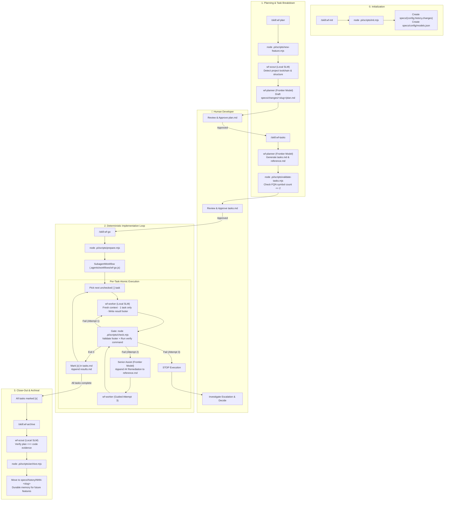

# pi-local-workflow ⚡🤖

[](#status--project-nature)
[](https://arxiv.org/abs/2602.11865)
[](https://pi.dev)
[](https://github.com/tintinweb)
[-brightgreen.svg)](#-economics-98-cost-reduction)
[](https://github.com/ggml-org/llama.cpp)
[](https://opensource.org/licenses/MIT)

> **Ultra-low-cost, multi-agent software engineering framework for [pi](https://pi.dev): atomic execution on local SLMs (2B–27B) with deterministic verification gates and frontier orchestrators.**

---

### ⚠️ Status: Archived Technical Proof of Concept

> **This repository is an archived technical exploration and reference implementation.**
> 
> The core research hypothesis **has been empirically validated**: delegating atomic development tasks to constrained local small language models (SLMs) while reserving frontier models strictly for architectural planning and orchestration is fully functional and delivers a **~98% cost reduction** in token expenditure (based on author's empirical benchmarks).
>
> The project is preserved in an archived state as a working blueprint for the community. For details on key learnings and how to extend this work (particularly regarding TDD and test harness rigor), see [Empirical Insights & The Road to v2](#-empirical-insights--the-road-to-v2).

---

## 💡 Theoretical Foundation: Inspired by Google DeepMind

`pi-local-workflow` is a real-world software engineering translation of principles introduced in Google DeepMind's research paper:

> **[Intelligent AI Delegation](https://arxiv.org/abs/2602.11865)**  
> *Nenad Tomašev, Matija Franklin, Simon Osindero (Google DeepMind, Feb 2026)*  
> arXiv:2602.11865 [cs.AI]

The paper establishes that scalable, safe agentic delegation requires moving away from naive heuristic prompting and toward:
1. **Clear Specifications & Role Boundaries**: Explicit, non-overlapping divisions of authority between delegator and delegatee.
2. **Transfer of Authority with Verifiable Accountability**: Delegation contracts where tasks are formally bounded and verified rather than trusted by declaration.
3. **Dynamic Trust & Resilience**: Automated mechanisms to detect delegatee failure, halt cascades, and adaptively escalate back to higher-capability supervisors.

`pi-local-workflow` operationalizes these concepts into a deterministic software engineering runtime:

| DeepMind Delegation Principle | `pi-local-workflow` Implementation |
|---|---|
| **Role Separation & Authority Transfer** | Strict 4-role hierarchy: **Orchestrator** (session manager), **Planner** (frontier architect), **Scout** (read-only local finder), and **Worker** (single-task atomic local executor). |
| **Clear Specification Boundaries** | Quantitative atomicity via Symbol IDs (FQN) — each worker task defines $\le 2$ symbols and touches $\le 2$ files. Zero design improvisation. |
| **Mechanisms for Trust (Verified vs Declared)** | Anti-shallow verification: process exit code `0` under the system shell is the *sole* criterion for success. Model self-reports of "tests pass" are discarded. |
| **Adaptive Escalation & Systemic Resilience** | 2-tier retry loop: 2 junior local attempts $\to$ 1 senior-assisted remediation appended to `reference.md` $\to$ deterministic hard stop for human review. |

---

## ⚡ Superpowers & Key Highlights

- 💰 **~98% Cost Reduction (Empirical Benchmarks)** — Slash LLM API expenses by confining frontier models (Claude 3.7 / Opus / GPT-4o) to high-level planning and single-shot senior escalations, while running thousands of iterative edit-and-verify loops locally at $0 marginal cost.
- 🎯 **Quantitative Atomicity via Symbol IDs (FQN)** — Bounded cognitive load calibrated for ultra-small models (2B–27B). Tasks are constrained by structural invariants (`defines.length <= 2`) rather than fuzzy prose parsing.
- 🛡️ **Zero-Improvisation Deterministic Gates** — Hard shell verification via `.pi/scripts/check.mjs`. If the test suite or compiler does not exit with code `0`, the task does not pass.
- 🌐 **100% Product Language Agnostic** — Zero language bias. Works seamlessly with C, C#, Rust, Go, Python, Swift, Zig, TypeScript, and Java. Tooling scripts use Node standard library with zero runtime dependencies.
- 🔄 **Self-Contained Relay Skills** — Fully integrated into `pi` through 5 declarative skills (`wf-init`, `wf-plan`, `wf-tasks`, `wf-go`, `wf-archive`).
- 📊 **Real-Time TUI Telemetry** — Inspect live agent execution, token counters, tool calls, and worker conversations directly from the `pi` terminal dashboard (`/agents`).

---

## 💰 Economics: ~98% Cost Reduction

In standard autonomous coding harnesses, every file read, multi-attempt test run, linting cycle, and minor syntax correction consumes expensive frontier tokens with quadratic context inflation.

```
Standard Frontier Agent Loop:
  User Request ──► [Frontier LLM: Plan + Read + Edit + Re-read + Retry + Verify]
                   ▲═════════════════════════════════════════════════════════════▲
                   (All iterations billed at $3.00 - $15.00 / MTok)

pi-local-workflow Architecture:
  User Request ──► [Frontier Planner]  (One-time plan & test design)
                         │
                         ▼
                   [Local Scout]       (Read-only project reconnaissance @ $0)
                         │
                         ▼
                   [Local Worker SLM]  (Atomic code edits in clean context @ $0)
                         │
                         ▼
                   [System OS Gate]    (Compiler / Test exit code 0)
```

By decoupling architectural intent from raw mechanical code typing:
- **Planning & Architecture (~2% of tokens)**: Consumes premium frontier model tokens once to construct `plan.md`, `tasks.md`, and `reference.md`.
- **Reconnaissance & Implementation (~98% of tokens)**: Handled entirely by local models (e.g. Qwen 2.5 / 3.8, DeepSeek-R1-Distill, Gemma 2) via `llama.cpp` or Ollama at **zero marginal token cost**.

*Note: The ~98% cost reduction figure reflects empirical testing and token-accounting benchmarks conducted during the implementation of this research prototype.*

---

## 🔬 Empirical Insights & The Road to v2

### The Challenge: Literalism & Shallow Verification in Small Models

During the research phase with local models in the **2B, 9B, 12B, and 27B** parameter classes, a critical behavioral pattern emerged:

1. **Extreme Literalism**: When strictly boxed into micro-tasks, small models take the path of least resistance. They will implement the absolute bare minimum required to make a simplistic verify command return exit code `0`.
2. **Under-Testing & Shallow Passes**: If a task verification step is too basic (e.g., simple file existence or a superficial smoke check), the local model satisfies the letter of the contract without exercising boundary conditions, resulting in silent edge-case regressions downstream.

### The Next Frontier: Test-Driven Development (TDD) Engine

For developers looking to fork or continue this research, the recommended architectural evolution is transitioning the engine to **Strict Test-Driven Development (TDD)**:

```
┌─────────────────────────────────────────────────────────────────────────────┐
│                       The Proposed TDD Evolution                            │
│                                                                             │
│  1. Senior Planner (Frontier) writes the Red Battery first:                │
│     - Exhaustive, failing behavioral tests defining all edge cases.         │
│     - Concrete inputs, expected outputs, and error state assertions.        │
│                                                                             │
│  2. Deterministic Pre-Flight Gate:                                          │
│     - Verify the test fails for the expected reason (Exit != 0).            │
│                                                                             │
│  3. Junior Worker (Local SLM) constrained to make tests Green:              │
│     - Worker has no ability to weaken or edit the test harness.             │
│     - The SLM's literalism becomes a feature: it writes strictly what       │
│       is needed to satisfy comprehensive, pre-baked specifications.        │
└─────────────────────────────────────────────────────────────────────────────┘
```

By having the senior model generate rigorous test fixtures *prior* to implementation, the literal nature of small local models is transformed into an asset rather than a liability.

---

## 🔄 Complete Workflow Architecture



---

## 🚀 Getting Started & Installation

### 1. Prerequisites

- **Node.js**: `v18.0.0` or later (pure ESM, uses native Node runtime).
- **[pi](https://pi.dev) coding agent harness**:
  ```bash
  npm install -g @earendil-works/pi-coding-agent
  ```
- **Required `pi` Extension**:
  - **`@tintinweb/pi-subagents`** (by [@tintinweb](https://github.com/tintinweb)) — **Mandatory core engine**. Powers the multi-agent infrastructure: registers the `Agent` and `SubagentWorkflow` tool interfaces, coordinates subagent lifecycles, and powers the interactive `/agents` terminal dashboard used by `.agents/workflows/wf-go.js`.
    ```bash
    pi install npm:@tintinweb/pi-subagents
    ```
- **Local Inference Server**:
  - [llama.cpp](https://github.com/ggml-org/llama.cpp) (recommended, via `/llama` server), [Ollama](https://ollama.ai), or any OpenAI-compatible local API.
  - A recommended local model loaded (e.g. `Qwen/Qwen2.5-Coder-7B-Instruct`, `Qwen/Qwen2.5-Coder-14B-Instruct`, or `Qwen/Qwen3.8-27B`).

### 2. Project Setup

Clone the repository and inspect the framework layout:

```bash
git clone https://github.com/xinaps-dev/pi-local-workflow.git
cd pi-local-workflow
```

### 3. Initialize the Workflow Engine

Inside a `pi` session in your project repository, run the initialization skill:

```bash
/skill:wf-init
```

This will automatically create the runtime scaffolding under `specs/`:
- `specs/config/models.json` — Model routing configuration.
- `specs/history/` — Durable repository memory of archived features.
- `specs/changes/` — Active feature workspace.

### 4. Configure Local Model Profiles

Edit `specs/config/models.json` to match your local inference provider and model identifier:

```json
{
  "worker": {
    "provider": "llama.cpp",
    "model": "qwen2.5-coder-7b-instruct"
  },
  "scout": {
    "provider": "llama.cpp",
    "model": "qwen2.5-coder-7b-instruct"
  }
}
```

*Note: The orchestrator and planner automatically inherit your active `pi` session model (e.g. Claude 3.7 Sonnet, OpenAI o3-mini).*

---

## 💻 Operational Walkthrough

Developing a feature with `pi-local-workflow` follows a structured 4-step cadence:

### Step 1: Feature Planning (`/skill:wf-plan`)
```bash
/skill:wf-plan
```
1. Creates `specs/changes/<slug>/plan.md` deterministically with the system clock.
2. Dispatches `wf-scout` (local) to identify existing compilers, libraries, and greenfield status.
3. Dispatches `wf-planner` (frontier) to draft architecture, interfaces, and testing strategies.
4. **Human Gate**: Halts and prompts you to review and approve `plan.md`.

### Step 2: Atomic Task Breakdown (`/skill:wf-tasks`)
```bash
/skill:wf-tasks
```
1. `wf-planner` converts the approved plan into atomic tasks in `tasks.md` and pre-bakes complex algorithms in `reference.md`.
2. Deterministic validation runs via `.pi/scripts/validate-tasks.mjs`:
   - Enforces sequential `T001..TNNN` task IDs.
   - Enforces $\le 2$ defined symbols per task.
   - Enforces non-empty `verify:` commands (rejecting shallow `grep` checks).
3. **Human Gate**: Displays the task list and verification coverage for your sign-off.

### Step 3: The Execution Loop (`/skill:wf-go`)
```bash
/skill:wf-go
```
1. `.pi/scripts/prepare.mjs` generates an inlined execution script.
2. Invokes `SubagentWorkflow` running `.agents/workflows/wf-go.js`.
3. Iterates through tasks sequentially:
   - Worker runs in a fresh, isolated subagent context.
   - On completion, `.pi/scripts/check.mjs` executes the task's `verify:` command.
   - If exit code is `0`, marks `[x]` in `tasks.md` and logs duration in `results.md`.
   - If it fails twice, escalates to **Senior Assist** (frontier model appends exact remediation steps to `reference.md`) for one guided retry.
   - If still failing, halts execution safely and alerts the developer.

#### Live Telemetry & Inspection
During execution, monitor progress live via the `pi` terminal UI:
- Run `/agents` $\to$ Select the workflow row $\to$ Press `Enter` to open the **Inspector**.
- **Keys**: `p` (pause) · `x` (stop) · `s` (skip task) · `r` (retry) · `c` (inspect full worker conversation).

### Step 4: Verification & Archival (`/skill:wf-archive`)
```bash
/skill:wf-archive
```
1. Dispatches `wf-scout` to verify every requirement in `plan.md` against actual code with `file:line` evidence.
2. Surfaces any discrepancies to the user for final approval.
3. `.pi/scripts/archive.mjs` deterministically stamps the feature and moves `specs/changes/<slug>` to `specs/history/NNN-<slug>`.

---

## 📁 Repository Anatomy

```
pi-local-workflow/
├── PHILOSOPHY.md        # The 9 Inviolable Laws & architectural constitution
├── .agents/             # Portable skills & workflow definitions
│   ├── skills/          # pi skills: wf-init · wf-plan · wf-tasks · wf-go · wf-archive
│   └── workflows/       # wf-go.js — portable deterministic loop engine
├── .pi/
│   ├── agents/          # Agent system prompts and capability profiles
│   │   ├── wf-worker.md # Worker agent (local model, read·edit·bash·grep·find)
│   │   ├── wf-scout.md  # Scout agent (local model, read-only search)
│   │   └── wf-planner.md# Senior planner (inherits session frontier model)
│   └── scripts/         # Deterministic Node CLI tooling (0 runtime dependencies)
│       ├── init.mjs     # Scaffolding initializer
│       ├── new-feature.mjs # Slug and directory creation
│       ├── validate-tasks.mjs # Contract validator & symbol counter
│       ├── prepare.mjs  # Run preparation & script generation
│       ├── check.mjs    # Shell verification gate & task marker
│       └── archive.mjs  # Close-out and durable memory archiver
└── specs/               # System state & specifications (shared in git)
    ├── config/          # models.json — model routing profile
    ├── history/         # Durable memory of completed & archived features
    └── changes/         # Active feature workspace (plan.md, tasks.md, results.md)
```

---

## ⚖️ License

This project is licensed under the **MIT License with Attribution & Repository Link Requirement**. See the [LICENSE](LICENSE) file for the full text.

> **Attribution Requirement**: You are free to use, modify, and distribute this software, provided that any public distribution, fork, or derivative work includes clear attribution to **xinaps** and a direct hyperlink to the original repository:
> [`https://github.com/xinaps-dev/pi-local-workflow`](https://github.com/xinaps-dev/pi-local-workflow)

---

<div align="center">
  <sub>Inspired by Google DeepMind's <i>Intelligent AI Delegation</i> (arXiv:2602.11865). Engineered for <a href="https://pi.dev">pi</a>.</sub>
</div>
